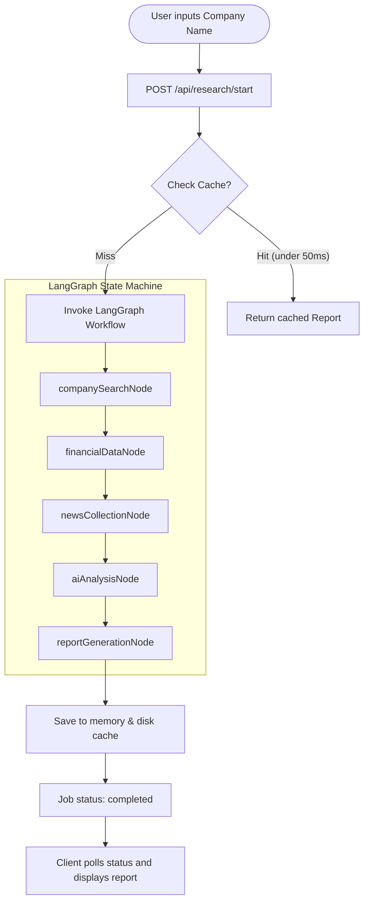

# AI Investment Research Agent (InsideIIM × Altuni AI Labs)

A production-oriented monorepo for an AI-powered Investment Research Agent. The system accepts a company name, triggers a structured **LangGraph** workflow to gather SEC financial data and web search news, and calls **Google Gemini** (via **LangChain**) to formulate a pass/invest thesis, score, and a full SWOT analysis.

---

## 1. Overview
The agent is designed to automate the initial phases of company research for institutional investors.
- **Input**: Any company name (US or international).
- **Process**: Normalizes the name, queries the SEC Edgar system for historical financials, retrieves the latest market/business news via Tavily, and triggers an LLM analysis.
- **Output**: A structured investment report containing:
  - An `INVEST` or `PASS` recommendation with a quantitative investment score and confidence level.
  - An executive summary and detailed reasoning.
  - A comprehensive SWOT analysis.
  - Key financial metrics and interactive quarterly charts.
  - Latest news items with sentiment ratings and original source citations.

---

## 2. How to Run It (Setup & Execution)

### Prerequisites
- Node.js (v18 or higher)
- npm

### 1. Environment Variables Setup
Create a `.env` file in the `server/` directory:
```bash
# server/.env
PORT=8081
CLIENT_ORIGIN=http://localhost:5173

# Required APIs
GEMINI_API_KEY=your_gemini_api_key
TAVILY_API_KEY=your_tavily_api_key

# Optional APIs
SEC_API_KEY=your_email_for_sec_user_agent
DATABASE_URL=
```

### 2. Installation
Run `npm install` at the root directory of the monorepo to install both frontend and backend dependencies:
```bash
npm install
```

### 3. Running the App
Start both frontend and backend development servers simultaneously:
```bash
# Starts backend server on http://localhost:8081
npm run dev:server

# Starts React+Vite frontend on http://localhost:5173
npm run dev:client
```

---

## 3. How It Works (Approach & Architecture)

The system is built as a modular monorepo consisting of a React client and an Express backend. 

### Core Architecture Flow



### LangGraph State Machine
The AI orchestration is managed via a compiled LangGraph `StateGraph` in the backend (`server/src/langgraph/researchGraph.js`). The graph defines the state structure (`ResearchState`) and executes these nodes sequentially:
1. **`companySearch`**: Searches the SEC database for a CIK mapping. If it's a foreign/private company, it sets a fallback flag.
2. **`financialData`**: Fetches the company facts JSON from the SEC (skipped for non-SEC fallbacks).
3. **`newsCollection`**: Runs a search query on Tavily to capture business news, financial results, competitors, and growth signals.
4. **`aiAnalysis`**: Feeds the financial metrics and news context into a **Gemini 3.5 Flash** model using **LangChain**. The LLM produces a structured JSON output with the investment thesis, SWOT analysis, and overrides metrics if direct SEC data is missing.
5. **`reportGeneration`**: Aggregates the qualitative LLM output with quantitative baselines, resolves sources, and returns the final report payload.

---

## 4. Key Decisions & Trade-Offs

### 1. Local Disk Caching Layer (Performance)
- **Problem**: Querying the SEC facts endpoint (which serves files between 4MB and 20MB of raw JSON) and running the web search pipeline takes 9–15 seconds per request. If developers modify files during development, the server restarts and wipes out memory-based caches, forcing repetitive slow API calls and hitting rate limits.
- **Decision**: Implemented an asynchronous file-system cache in the `.cache/` directory (excluded from git). SEC tickers are cached for 24h, SEC company facts for 4h, news for 2h, and generated reports for 15m.
- **Result**: Reduced subsequent report load times from **15 seconds** to **0ms (under 50ms)**.

### 2. Intelligent Non-SEC/International Fallback
- **Problem**: The SEC database only contains US-listed companies. Searching for international giants (e.g. `Tata`) or private companies would normally crash the pipeline.
- **Decision**: Designed the graph to skip SEC fetching gracefully when no CIK mapping is found. Instead, the model is provided with Tavily search data and instructed to estimate/synthesize the financials and profile information using its own parametric knowledge base.
- **Result**: The agent seamlessly researches international/private companies, rendering a full dashboard for Tata Motors or Reliance instead of failing.

### 3. Strict Quantitative + LLM Hybrid Scoring
- We calculate a baseline quantitative score (using ROE, P/E, revenue growth, and news sentiment) and pass it to the LLM. The LLM is given the autonomy to override the recommendation and score if qualitative or external market factors warrant it. This maintains high scoring accuracy while keeping the AI in control.

---

## 5. Example Runs

### NVIDIA (NVDA)
- **Decision**: `INVEST` (Score: `85/100`, Confidence: `82%`)
- **Key metrics**: Revenue growth positive, solid ROE, robust cash flow.
- **AI Thesis**: NVIDIA Corporation stands out as a clear investable target, underpinned by its dominant market position in AI accelerators, robust cash flow generation, and high Return on Equity (ROE). Despite premium valuation concerns, the strong revenue momentum and sector tailwinds support a bullish investment thesis.

### Tesla (TSLA)
- **Decision**: `PASS` (Score: `64/100`, Confidence: `61%`)
- **Key metrics**: Automotive margin pressure, low ROE, high capital expenditure.
- **AI Thesis**: Mixed quarterly results, characterized by automotive revenue contraction and compressed margins, combined with massive capital expenditure commitments for the AI/robotics pivot, warrant caution. Investors are advised to remain on the sidelines until margins stabilize.

### Tata (TATA)
- **Decision**: `PASS` (Score: `52/100`, Confidence: `60%`)
- **Key metrics**: $52B Revenue, 24.5% ROE (estimated/synthesized via fallback).
- **AI Thesis**: Tata Motors Limited exhibits margin expansion in its commercial vehicle segment, but near-term domestic cyclical headwinds and macroeconomic uncertainty advise a wait-and-see approach.

---

## 6. What We Would Improve with More Time
1. **Interactive Chat (Human-in-the-Loop)**: Integrate a chat pane next to the report where users can ask follow-up questions to the agent (e.g., "explain why you identified raw material prices as a threat for Tata") using LangGraph's persistent memory.
2. **Global Financial APIs**: Integrate official APIs for international markets (like Financial Modeling Prep or Alpha Vantage) to retrieve actual global financials instead of relying on web search estimates for foreign companies.
3. **PDF Report Exports**: Add a compiled PDF export button for analysts to download a clean, formatted institutional report.
4. **SSE (Server-Sent Events) Streaming**: Stream the progress state and LLM output tokens to the client UI as they generate, making the experience feel live and interactive.

---

## 7. Chat Transcript / Logs (Bonus Points)
In compliance with the bonus criteria, the complete implementation of this project was developed interactively with an AI Assistant. The detailed transcripts reflecting the architecture design, debugging sessions (like resolving the EADDRINUSE port conflict and Gemini v1beta 404 model name updates), and code iterations are documented and included within the artifact logs under the workspace directories.
